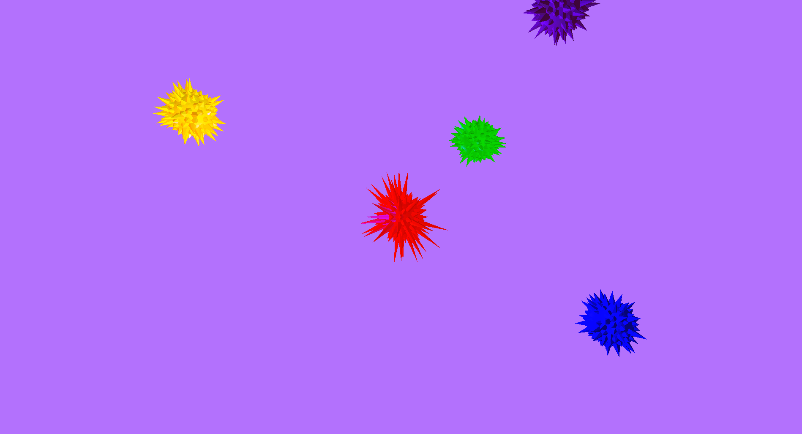
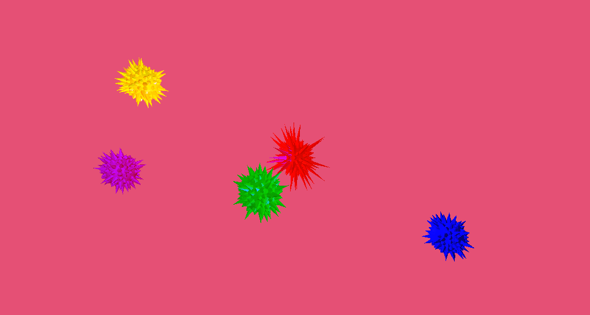

# OpenGL: Buzz balls

Buzz. Boing. Boing. Buzz. Boing.

This is an OpenGL application with a composable transform animation system, combined with a vertex shader that lets spikes on an icosphere jump out based on a function of time.

## Screenshots

## How to run

Open the `Code/OpenGL_buzzballs.pro` file with Qt 5 creator and build the application. Then run it.

